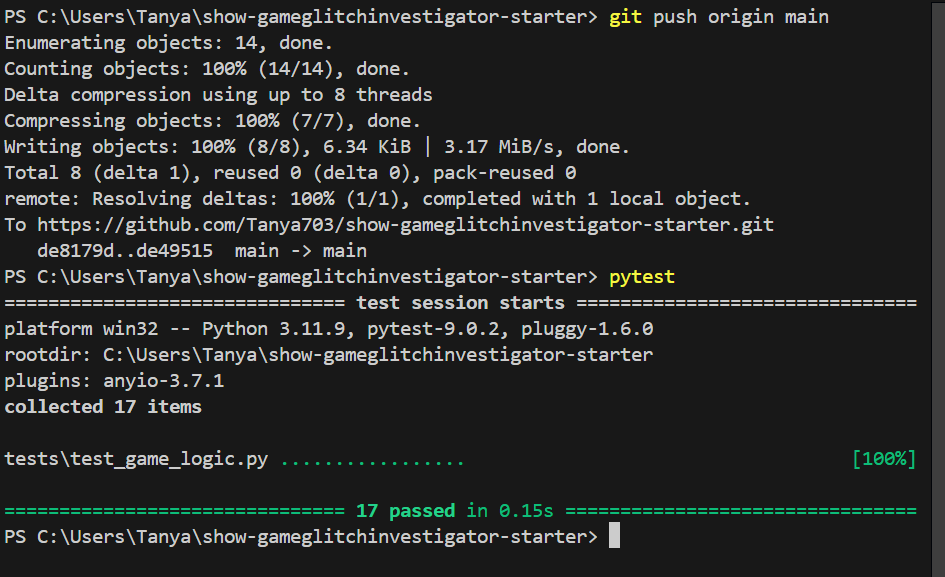

# 🎮 Game Glitch Investigator: The Impossible Guesser

## 🚨 The Situation

You asked an AI to build a simple "Number Guessing Game" using Streamlit.
It wrote the code, ran away, and now the game is unplayable. 

- You can't win.
- The hints lie to you.
- The secret number seems to have commitment issues.

## 🛠️ Setup

1. Install dependencies: `pip install -r requirements.txt`
2. Run the broken app: `python -m streamlit run app.py`

## 🕵️‍♂️ Your Mission

1. **Play the game.** Open the "Developer Debug Info" tab in the app to see the secret number. Try to win.
2. **Find the State Bug.** Why does the secret number change every time you click "Submit"? Ask ChatGPT: *"How do I keep a variable from resetting in Streamlit when I click a button?"*
3. **Fix the Logic.** The hints ("Higher/Lower") are wrong. Fix them.
4. **Refactor & Test.** - Move the logic into `logic_utils.py`.
   - Run `pytest` in your terminal.
   - Keep fixing until all tests pass!

## 📝 Document Your Experience

- [x] Describe the game's purpose.

  Game Glitch Investigator is a number-guessing game built with Streamlit. The player selects a difficulty level (Easy, Normal, or Hard), which sets the range of the secret number and the number of attempts allowed. On each turn the player submits a guess and receives a hint — "Go Higher" or "Go Lower" — until they guess correctly or run out of attempts. A score is tracked throughout, awarding more points for winning in fewer guesses and deducting points for wrong guesses.

- [x] Detail which bugs you found.

  1. **Hard difficulty was easier than Normal** — Hard used a range of 1–50, which is narrower (easier) than Normal's 1–100.
  2. **Hints were inverted and broken** — `check_guess` used incorrect comparison logic and a flawed type-casting fallback, causing "Go Higher" and "Go Lower" to be swapped or wrong.
  3. **Win scoring used the wrong formula** — `update_score` calculated win points using `attempt_number + 1` instead of `attempt_number - 1`, making first-attempt scores too low.
  4. **Wrong guesses awarded points** — A "Too High" guess on an even attempt number gave +5 points instead of deducting 5.
  5. **Invalid guesses burned attempts** — The attempt counter incremented before input validation, so blank or non-numeric entries wasted a turn.
  6. **Session state never reset on difficulty change** — Switching difficulty mid-game kept the old secret number, old attempt count, and old score, causing negative attempts left and misleading hints.
  7. **Hint disappeared after one render cycle** — The hint was rendered inside `if submit:`, so it vanished on the next Streamlit rerun (requiring a double-click to see it).
  8. **`st.rerun()` not available in Streamlit 1.22** — The new-game button crashed the app with `AttributeError` because `st.rerun()` only exists in Streamlit 1.27+.

- [x] Explain what fixes you applied.

  1. Changed Hard difficulty range from 1–50 to 1–1000 in `logic_utils.get_range_for_difficulty`.
  2. Rewrote `check_guess` with correct integer comparisons: guess > secret → "Go Lower", guess < secret → "Go Higher".
  3. Fixed win score formula from `attempt_number + 1` to `attempt_number - 1`.
  4. Removed the conditional +5 for even attempts in `update_score`; wrong guesses now always deduct 5.
  5. Moved `st.session_state.attempts += 1` inside the valid-guess branch so invalid input does not consume an attempt.
  6. Added difficulty-change detection in `app.py`: when the selected difficulty differs from the stored one, all session state (secret, attempts, score, status, history, hint) is reset.
  7. Stored the hint as `(outcome, message)` in `st.session_state.hint` and moved its display outside the `if submit:` block so it persists across reruns.
  8. Replaced `st.rerun()` with `st.experimental_rerun()` for Streamlit 1.22 compatibility.
  9. Refactored all four logic functions (`get_range_for_difficulty`, `parse_guess`, `check_guess`, `update_score`) from `app.py` into `logic_utils.py`, and added `conftest.py` so pytest can resolve the module from the project root.

## 📸 Demo

- [.] [Insert a screenshot of your fixed, winning game here]

## 🚀 Stretch Features

- [ ] [If you choose to complete Challenge 4, insert a screenshot of your Enhanced Game UI here]
